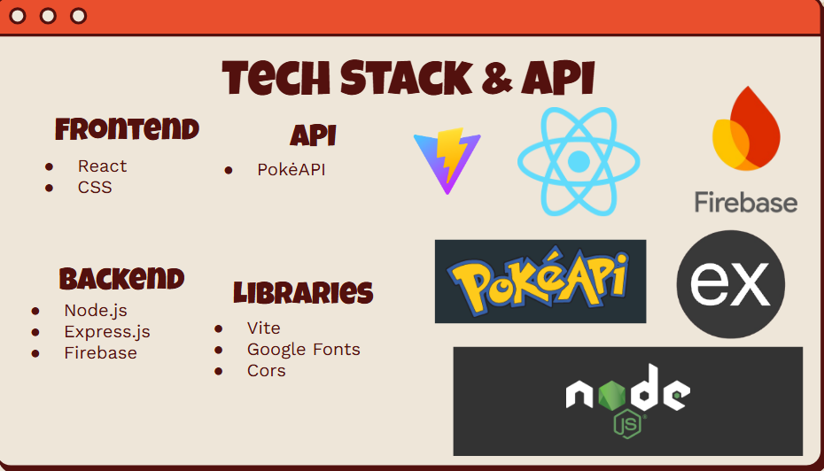

# Pokemon Battle Simulator 
Overview: Users can create an account choose a pokemon from a preselected list or take their chances with a random pokemon, where they will go head to head with the CPU. 

# Features 
* User Authentication
- Sign up, login, and logout using Firebase Authentication.
* Dashboard
- Displays user stats: wins and losses.
* Pokémon Selection
- Choose a Pokémon from a predefined list. (Homework 2) 
- Option to Choose Random Pokémon using PokéAPI.
* Battle Simulator
* API Integration
- Fetch Pokémon details (name, stats, moves, and sprites) using PokéAPI.Fallback to default Pokémon if the API is unavailable.
* Tracks battle outcomes and updates wins and losses in Firebase Firestore.
* Replay Button

# Tech Stack 


# How to Run project 
Make sure you have Node.js installed 
1. Navigate to the directory where you want to clone/run/save the application:
    ```sh
     cd example_directory
    ```
2. Navigate to Project Directory:
 ```sh
    cd Pokemon
```
3. Navigate to Frontend Directory:
 ```sh
    npm install 
```
4. Navigate to Backend Directory:
 ```sh
    npm install 
```
5. Run Project: 
**NOTE:** To run project make sure you are in root project folder /Pokemon
    ```sh
    npm start
    ```
